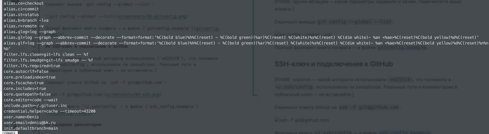
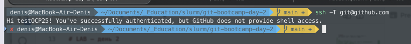
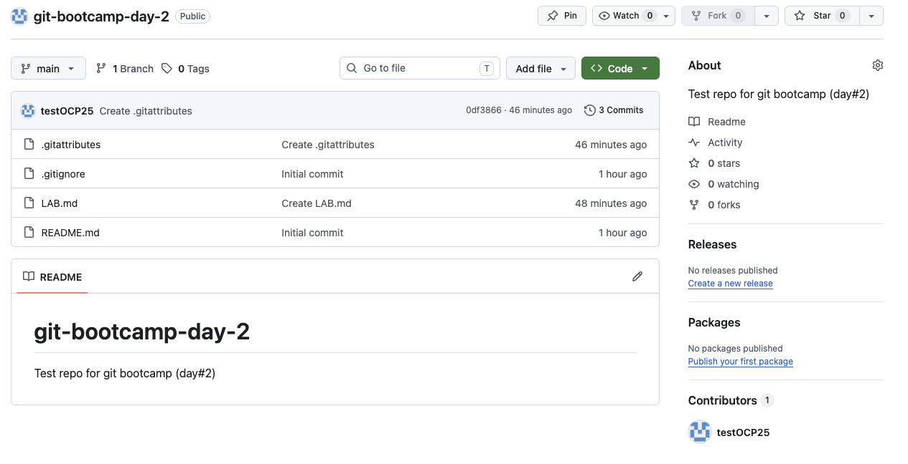
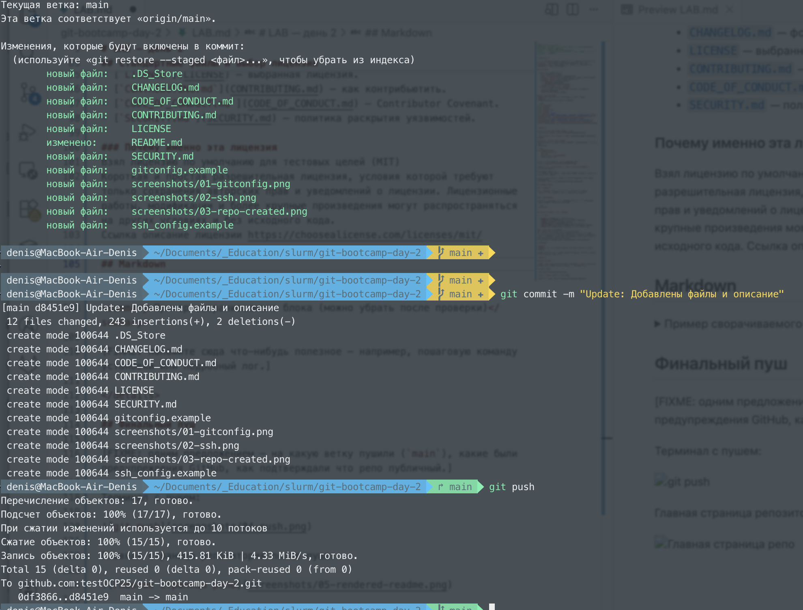
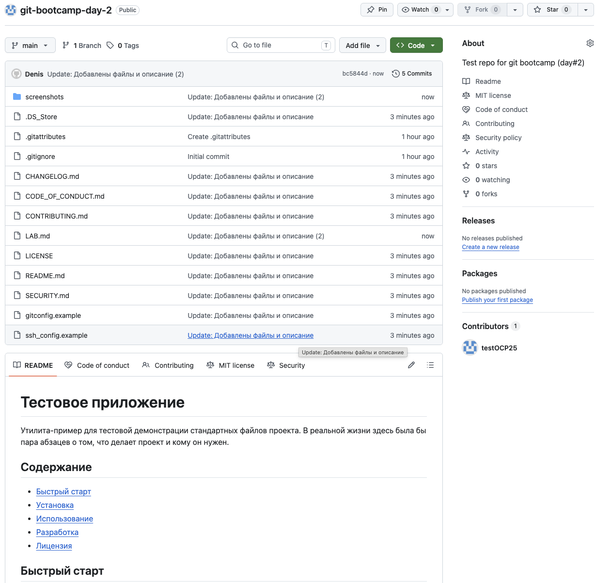

<!--
Шаблон отчёта по ДЗ дня 2.
Скопируйте этот файл в корень своего репозитория `git-bootcamp-day-2` под именем `LAB.md` и заполните.
Удалите этот HTML-комментарий перед коммитом.
Места `<...>` — заменяйте на свои значения. Места `[FIXME: ...]` — это подсказки, что написать.
-->

# LAB — день 2

Отчёт о выполнении домашнего задания дня 2 в рамках курса ["Интенсив по погружению в GIT"](https://slurm.io/git-intensive): настройка `gitconfig` и SSH, создание публичного репозитория, наполнение его служебными и стандартными файлами.

## Содержание

- [LAB — день 2](#lab--день-2)
  - [Содержание](#содержание)
  - [Настройка gitconfig](#настройка-gitconfig)
  - [SSH-ключ и подключение к GitHub](#ssh-ключ-и-подключение-к-github)
  - [Создание репозитория](#создание-репозитория)
  - [Служебные файлы](#служебные-файлы)
    - [`.gitignore`](#gitignore)
    - [`.gitattributes`](#gitattributes)
  - [Стандартные файлы и выбор лицензии](#стандартные-файлы-и-выбор-лицензии)
    - [Почему именно эта лицензия](#почему-именно-эта-лицензия)
  - [Markdown](#markdown)
  - [Финальный пуш](#финальный-пуш)

## Настройка gitconfig
Добавил настройки дефолтного бранча main и редактор VScode
<details>
<summary>Создал несколько алиасов:</summary>

```bash
alias.co=checkout
alias.ci=commit
alias.st=status
alias.b=branch -lva
alias.r=remote -v
alias.glog=log --graph
alias.gl=log --graph --abbrev-commit --decorate --format=format:'%C(bold blue)%h%C(reset) - %C(bold green)(%ar)%C(reset) %C(white)%s%C(reset) %C(dim white)- %an <%ae>%C(reset)%C(bold yellow)%d%C(reset)'
alias.glf=log --graph --abbrev-commit --decorate --format=format:'%C(bold blue)%h%C(reset) - %C(bold green)(%ar)%C(reset) %C(white)%s%C(reset) %C(dim white)- %an <%ae>%C(reset)%C(bold yellow)%d%C(reset)%n%n%b
```

</details>

Скриншот вывода `git config --global --list`:


Полный фрагмент моего конфига — в файле [`gitconfig.example`](gitconfig.example).

## SSH-ключ и подключение к GitHub
Использован алгоритм использовали (`ed25519`), без passphrase в тестовых целях. 
.ssh/config:

```bash
Host github-personal
    HostName github.com
    User git
    IdentityFile ~/.ssh/id_ed25519
    AddKeysToAgent yes%
```

Скриншот ответа GitHub на `ssh -T git@github.com`:


Фрагмент моего `~/.ssh/config` — в файле [`ssh_config.example`](ssh_config.example).

## Создание репозитория
При создании выбрал public, созданы файлы README, gitignore. Собирал всё локально, потом пушил 

Скриншот свежесозданного репозитория (после добавление вручную файла .gitattributes):


## Служебные файлы

### `.gitignore`

Стек: `<Python>`. Выбрал, потому что был вариант при создании репозитория. Было любопытно, как это работает при создании


### `.gitattributes`

Минимум — `* text=auto` для нормализации переносов строк между macOS/Linux и Windows. Дополнительные правила:

```text
*.png binary
```

## Стандартные файлы и выбор лицензии

В корне лежат:

- [`README.md`](README.md) — визитка проекта.
- [`CHANGELOG.md`](CHANGELOG.md) — формат Keep a Changelog.
- [`LICENSE`](LICENSE) — выбранная лицензия.
- [`CONTRIBUTING.md`](CONTRIBUTING.md) — как контрибьютить.
- [`CODE_OF_CONDUCT.md`](CODE_OF_CONDUCT.md) — Contributor Covenant.
- [`SECURITY.md`](SECURITY.md) — политика раскрытия уязвимостей.

### Почему именно эта лицензия
Взял лицензию по умолчанию для тестовых целей (MIT)
Короткая и простая разрешительная лицензия, условия которой требуют только сохранения авторских прав и уведомлений о лицензии. Лицензионные работы, модификации и более крупные произведения могут распространяться на других условиях и без исходного кода.
Ссылка описание лицензии https://choosealicense.com/licenses/mit/

## Markdown

<details>
<summary>Пример сворачиваемого блока (можно убрать после проверки)</summary>

[FIXME: положите сюда что-нибудь полезное — например, пошаговую команду установки или подробный лог.]

</details>

## Финальный пуш

[FIXME: одним предложением — на какую ветку пушили (`main`), какие были предупреждения GitHub, как подтверждали что репо публичный.]

Терминал с пушем:



Главная страница репозитория после пуша:



